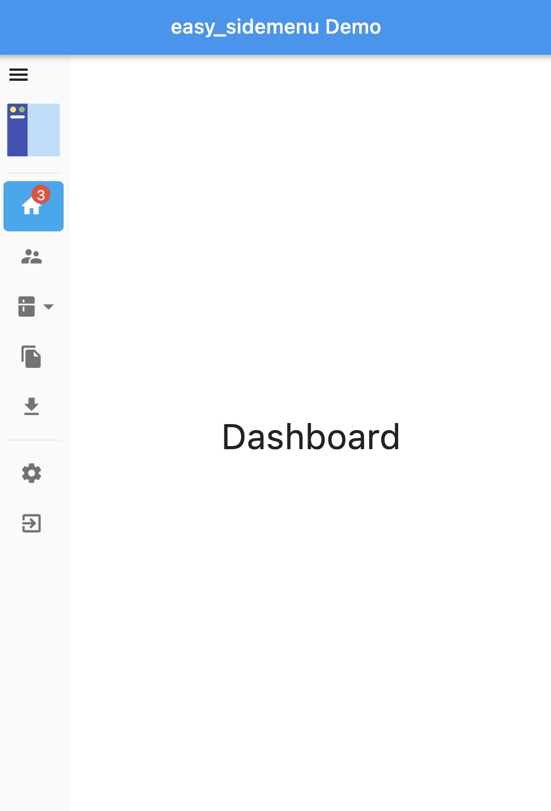

<div align="center" style="text-align:center">
<h1 align="center">Easy Sidemenu</h1>

</br>
<a href="https://github.com/Jamalianpour/easy_sidemenu/license">
    
</a>
<a href="https://pub.dev/packages/easy_sidemenu">
      
</a>
<a>
    
</a>
</div>

Easy sidemenu is An easy to use side menu (bar) for flutter that you can use for navigation in your application.

Sidemenu is a menu that is usually located on the left or right of the page and can used for navigation or other things.
Sidemenu is similar to bottom navigation bar but in the side of screen and usually used for larger screens.

## Screenshots

| Open                             | Compact                             |
| -------------------------------- | ----------------------------------- |
|  |  |

| Auto                              |
| --------------------------------- |
|  |

## Demo

You can see web demo here: [https://jamalianpour.github.io/easy_sidemenu](https://jamalianpour.github.io/easy_sidemenu)

## Usage

##### 1. add dependencies into you project pubspec.yaml file

```yaml
dependencies:
  easy_sidemenu: ^0.5.0
```

Run `flutter packages get` in the root directory of your app.

##### 2. import easy sidemenu lib

```dart
import 'package:easy_sidemenu/easy_sidemenu.dart';
```

Now you can use `SideMenu` as a widget in your code.

##### 3. use SideMenu

You must first define a list of items to display on `SideMenu`:

```dart
List<SideMenuItem> items = [
  SideMenuItem(
    title: 'Dashboard',
    onTap: (index, _) {
      sideMenu.changePage(index);
    },
    icon: Icon(Icons.home),
    badgeContent: Text(
      '3',
      style: TextStyle(color: Colors.white),
    ),
  ),
  SideMenuItem(
    title: 'Settings',
    onTap: (index, _) {
      sideMenu.changePage(index);
    },
    icon: Icon(Icons.settings),
  ),
  SideMenuItem(
    title: 'Exit',
    onTap: () {},
    icon: Icon(Icons.exit_to_app),
  ),
];
```

###### custom builder:

Instead of `title` and `icon` in `SideMenuItem` can use `builder` to create your customize items:

```dart
SideMenuItem(
  builder: (context, displayMode) {
    return Container();
  },
  onTap: () {},
),
```

After that you need to warp your main page to a `row` and then add `SideMenu` as first child of that, like below:

```dart
PageController pageController = PageController();
SideMenuController sideMenu = SideMenuController();

@override
void initState() {
  // Connect SideMenuController and PageController together
  sideMenu.addListener((index) {
    pageController.jumpToPage(index);
  });
  super.initState();
}

@override
Widget build(BuildContext context) {
  return Row(
    mainAxisAlignment: MainAxisAlignment.start,
    children: [
      SideMenu(
        // Page controller to manage a PageView
        controller: sideMenu,
        // Will shows on top of all items, it can be a logo or a Title text
        title: Image.asset('assets/images/easy_sidemenu.png'),
        // Will show on bottom of SideMenu when displayMode was SideMenuDisplayMode.open
        footer: Text('demo'),
        // Notify when display mode changed
        onDisplayModeChanged: (mode) {
          print(mode);
        },
        // List of SideMenuItem to show them on SideMenu
        items: items,
      ),
      Expanded(
        child: PageView(
          controller: pageController,
          children: [
            Container(
              child: Center(
                child: Text('Dashboard'),
              ),
            ),
            Container(
              child: Center(
                child: Text('Settings'),
              ),
            ),
          ],
        ),
      ),
    ],
  );
}
```

### Style

you can change style of side menu with `SideMenuStyle` :

```dart
style: SideMenuStyle(
  displayMode: SideMenuDisplayMode.auto,
  decoration: BoxDecoration(),
  openSideMenuWidth: 200,
  compactSideMenuWidth: 40,
  hoverColor: Colors.blue[100],
  selectedColor: Colors.lightBlue,
  selectedIconColor: Colors.white,
  unselectedIconColor: Colors.black54,
  backgroundColor: Colors.grey,
  selectedTitleTextStyle: TextStyle(color: Colors.white),
  unselectedTitleTextStyle: TextStyle(color: Colors.black54),
  iconSize: 20,
  itemBorderRadius: const BorderRadius.all(
      Radius.circular(5.0),
  ),
  showTooltip: true,
  showHamburger: true,
  itemHeight: 50.0,
  itemInnerSpacing: 8.0,
  itemOuterPadding: const EdgeInsets.symmetric(horizontal: 5.0),
  toggleColor: Colors.black54
),
```

#### Style Example

<details>
<summary>Code</summary>

```dart
style: SideMenuStyle(
  displayMode: SideMenuDisplayMode.auto,
  hoverColor: Colors.blue[100],
  selectedColor: Colors.blue[600],
  selectedTitleTextStyle: TextStyle(color: Colors.white),
  selectedIconColor: Colors.white,
  unselectedIconColor: Colors.white70,
  unselectedTitleTextStyle: TextStyle(color: Colors.white70),
  showHamburger: false
  decoration: BoxDecoration(
      borderRadius: BorderRadius.all(Radius.circular(8)),
      boxShadow: [
        BoxShadow(
          color: Color.fromARGB(255, 79, 117, 134),
          spreadRadius: 1,
          blurRadius: 10,
          offset: Offset(0, 0), // changes position of shadow
        ),
      ]),
  backgroundColor: Color.fromARGB(255, 79, 117, 134),
  // openSideMenuWidth: 200
),
```

</details>


#### Style Props

| props                    |         types          |                                   description                                   |
| :----------------------- | :--------------------: | :-----------------------------------------------------------------------------: |
| displayMode              | `SideMenuDisplayMode?` | SideMenuDisplayMode.auto, SideMenuDisplayMode.open, SideMenuDisplayMode.compact |
| decoration               |    `BoxDecoration?`    |                 Decoration of `SideMenu` background (container)                 |
| openSideMenuWidth        |       `double?`        |        Width of `SideMenu` when displayMode was SideMenuDisplayMode.open        |
| compactSideMenuWidth     |       `double?`        |      Width of `SideMenu` when displayMode was SideMenuDisplayMode.compact       |
| hoverColor               |        `Color?`        |                Color of `SideMenuItem` when mouse hover on that                 |
| selectedColor            |        `Color?`        |            Background color of `SideMenuItem` when item is selected             |
| selectedIconColor        |        `Color?`        |                       Color of icon when item is selected                       |
| unselectedIconColor      |        `Color?`        |                      Color of icon when item is unselected                      |
| backgroundColor          |        `Color?`        |                         Background color of `SideMenu`                          |
| selectedTitleTextStyle   |      `TextStyle?`      |                   Style of `title` text when item is selected                   |
| unselectedTitleTextStyle |      `TextStyle?`      |                  Style of `title` text when item is unselected                  |
| iconSize                 |       `double?`        |                         Size of icon on `SideMenuItem`                          |
| toggleColor              |        `Color?`        |                             Color of toggle button                              |
| itemBorderRadius         |     `BorderRadius`     |                           Border Radius of menu item                            |
| showTooltip              |         `bool`         |Property that will show user itemName in Tooltip when they'll hover over the item|
| itemInnerSpacing         |        `double`        |                           Inner spacing of menu item                            |
| itemOuterPadding         |  `EdgeInsetsGeometry`  |                           Outer padding of menu item                            |
| itemHeight               |        `double`        |                              Height of menu item                                |
| showHamburger            |         `bool`         |       Property that will show Hamburger on topLeft corner if set as `true`      |

---

Feel free to fork this repository and send pull request 🏁👍
